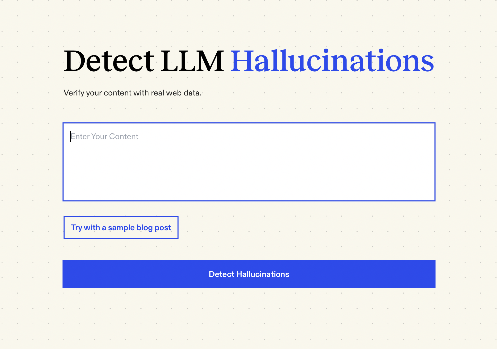

# 🔍 AI Hallucinations Detector
### Verify Content Accuracy with Real-Time Web Search



<br>

## 🎯 What is Hallucinations Detector?

Hallucinations Detector is a free and open-source tool that helps you verify the accuracy of AI-generated content instantly. Think of it as Grammarly, but for factual accuracy instead of grammar. It analyzes your content, identifies potential inaccuracies, and suggests corrections backed by reliable web sources.

<br>

## ✨ Key Features

- Real-time fact checking of AI-generated content
- Source-backed verification using Google search results
- Detailed explanations for identified inaccuracies
- Suggestion-based corrections
- Professional, clean interface

<br>

## 🛠️ How It Works

1. **Claim Extraction**: When you input your content, the tool uses Google's Gemini 1.5 Flash to break down your text into individual claims.

2. **Source Verification**: Each claim is checked using Serper.dev's search API to find reliable sources online that either support or refute it.

3. **Accuracy Analysis**: The claims and their corresponding sources are analyzed by our LLM to determine their accuracy.

4. **Results Display**: Finally, we show the results in a clear, professional interface, highlighting any inaccuracies and offering suggestions to fix them.

<br>

## 💻 Tech Stack
- **Search API**: [Serper.dev](https://serper.dev) - Google SERP API for reliable search results
- **Frontend**: [Next.js](https://nextjs.org/docs) with App Router, [TailwindCSS](https://tailwindcss.com), TypeScript
- **LLM**: [Google's Gemini 1.5 Flash](https://deepmind.google/technologies/gemini/flash/) - Fast and efficient model for content analysis
- **Hosting**: [Vercel](https://vercel.com/) for hosting and analytics

<br>

## 🚀 Getting Started

### Prerequisites
- Node.js 18+ 
- API keys for Serper.dev and Google Gemini

### Installation

1. Clone the repository
```bash
git clone https://github.com/[your-username]/hallucination-detector.git
cd hallucination-detector
```

2. Install dependencies
```bash
npm install
# or
yarn install
```

3. Set up environment variables
Create a `.env.local` file in the root directory and add your API keys:
```
SERPER_API_KEY=your_serper_api_key
GEMINI_API_KEY=your_gemini_api_key
```

4. Run the development server
```bash
npm run dev
# or
yarn dev
```

5. Open http://localhost:3000/hallucination-detector in your browser

<br>

## 🔑 API Keys

### Serper.dev API
- Sign up at [Serper.dev](https://serper.dev)
- Free tier includes 2,500 searches per month
- No credit card required

### Google Gemini API
- Get your API key from [Google AI Studio](https://aistudio.google.com/app/apikey)
- Free tier includes generous usage limits

<br>

## 📚 Usage

1. **Enter Content**: Paste the content you want to fact-check into the text area
2. **Analyze**: Click "Check for Hallucinations" to start the analysis
3. **Review Results**: See highlighted claims with verification status
4. **Apply Fixes**: Accept suggested corrections for any false claims

<br>

## 🤝 Contributing

Contributions are welcome! Please feel free to submit a Pull Request.

1. Fork the project
2. Create your feature branch (`git checkout -b feature/AmazingFeature`)
3. Commit your changes (`git commit -m 'Add some AmazingFeature'`)
4. Push to the branch (`git push origin feature/AmazingFeature`)
5. Open a Pull Request

<br>

## 📄 License

This project is licensed under the MIT License - see the LICENSE file for details.

<br>

## 🙏 Acknowledgments

- Google Gemini for providing the LLM capabilities
- Serper.dev for reliable search API access
- The open-source community for inspiration and support

<br>

---

Built with ❤️ by the open-source community